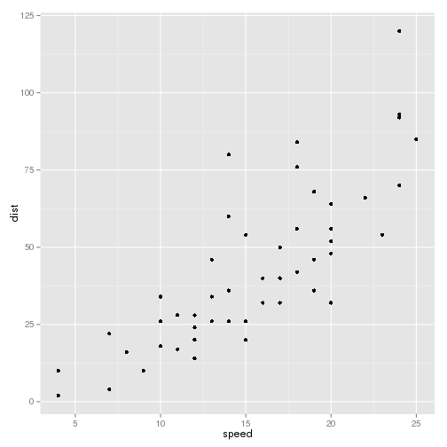

---
title: "knitr_session"
author: "Marianne Corvellec"
date: '2014-11-14'
output: html_document
---

(View source here: https://gist.github.com/mkcor/1ca67262c74c590bd6e9)

<button class="source R toggle btn btn-xs btn-primary"> R source</button><pre style=""><code class="source r"># install.packages("devtools")  # so we can install from GitHub
# devtools::install_github("ropensci/plotly")  # plotly is part of rOpenSci
 
library(plotly)</code></pre><button class="message R toggle btn btn-xs btn-info"> R message</button><pre style=""><code class="message r">## Loading required package: RJSONIO
## 
## Attaching package: 'RJSONIO'
## 
## The following objects are masked from 'package:rjson':
## 
##     fromJSON, toJSON
## 
## The following objects are masked from 'package:jsonlite':
## 
##     fromJSON, toJSON
## 
## Loading required package: ggplot2
## 
## Attaching package: 'ggplot2'
## 
## The following object is masked from 'package:NLP':
## 
##     annotate
</code></pre>

This is an R Markdown document. Markdown is a simple formatting syntax for
authoring documents. For more details on using R Markdown see
<http://rmarkdown.rstudio.com>.

You can embed an R code chunk like this:

<button class="source R toggle btn btn-xs btn-primary"> R source</button><pre style=""><code class="source r">summary(cars)</code></pre><button class="output R toggle btn btn-xs btn-success"> R output</button><pre style=""><code class="output r">##      speed           dist       
##  Min.   : 4.0   Min.   :  2.00  
##  1st Qu.:12.0   1st Qu.: 26.00  
##  Median :15.0   Median : 36.00  
##  Mean   :15.4   Mean   : 42.98  
##  3rd Qu.:19.0   3rd Qu.: 56.00  
##  Max.   :25.0   Max.   :120.00
</code></pre>

You can also embed plots, for example:

<button class="source R toggle btn btn-xs btn-primary"> R source</button><pre style=""><code class="source r">library(plotly)
gg <- ggplot(cars) + geom_point(aes(speed, dist))
gg</code></pre>

<button class="source R toggle btn btn-xs btn-primary"> R source</button><pre style=""><code class="source r">py <- plotly(username="r_user_guide", key="mw5isa4yqp")  # open plotly connection
gg <- ggplot(cars) + geom_point(aes(speed, dist))</code></pre>

<button class="source R toggle btn btn-xs btn-primary"> R source</button><pre style=""><code class="source r">#py <- plotly()
#py$ggplotly(gg, session="knitr", kwargs=list(filename="cars_knitr",
#                                             fileopt="overwrite"))</code></pre>

You can embed a static plot using Markdown syntax:

Notice that we simply appended a supported extension (.png) to the URL where the
plotly plot lives.

You can also use HTML syntax to embed iframes:
<iframe scrolling='no' seamless='seamless' style='border:none'
src='https://plot.ly/~MattSundquist/2509' width='800' height='500'></iframe>

<button type="button" class="navbar-toggle" data-toggle="collapse" data-target=".navbar-responsive-collapse">

</button>

<ul class="nav navbar-nav navbar-right"><li class="nav">
Toggle
</li>
<li class="dropup"><a href="#" class="dropdown-toggle" data-toggle="dropdown">Code 
<b class="caret"></b></a>
<ul class="dropdown-menu"><li class="dropdown-header">Languages</li>
<li class="active"><a href="#" class="toggle-global source R" type="source.R">R</a></li>
<li ><a href="#" type="all-source" class="toggle-global">All</a></li></ul></li>
<li class="dropup"><a href="#" class="dropdown-toggle" data-toggle="dropdown">Output
<b class="caret"></b></a>
<ul class="dropdown-menu"><li class="dropdown-header">Type</li>
<li class="active"><a href="#" class="toggle-global output" type="output">output</a></li>
<li ><a href="#" type="all-output" class="toggle-global">All</a></li></ul></li>
<li class="active"><a href="#" type="figure" class="toggle-global">Figures</a></li></ul>

Styled with 
<a href="https://github.com/jimhester/knitrBootstrap">knitrBootstrap</a>

<link rel="stylesheet" id="theme" href="https://netdna.bootstrapcdn.com/bootstrap/3.0.0/css/bootstrap.min.css" media="screen"></link><link rel="stylesheet" id="highlight" href="https://cdnjs.cloudflare.com/ajax/libs/highlight.js/7.3/styles/default.min.css" media="screen"></link>

