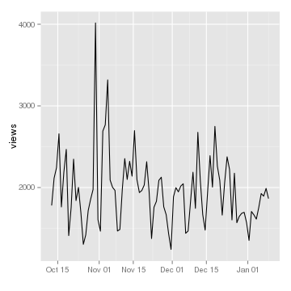
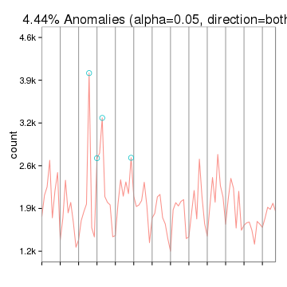
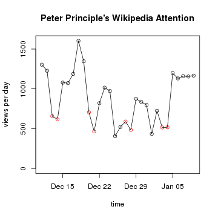

# Displaying an index of posts
* {{ site.posts }}
* 
    <li>
      <a href="{{ post.url }}">{{ post.title }}</a>
    </li>
  
<!-- http://jekyllrb.com/docs/collections/
{{ con tent }}
{{ out put }}
-->
# Change the default global options
https://github.com/jimhester/knitrBootstrap#chunk-options

```r
library(magrittr)
# https://github.com/jimhester/knitrBootstrap#chunk-options
# colors() [grep(patt = "dark", x = colours())]
#     panel: FALSE #  Use panels rather than buttons to toggle blocks.
opts_chunk$set(fig.width = 5, fig.height = 5)
# bootstrap.panel (FALSE) - panels rather than buttons to toggle blocks.
opts_chunk$set(background = c('gray10'), panel = TRUE) 
# http://getbootstrap.com/css/#grid
# bootstrap.thumbnail - (TRUE) - Thumbnail and lightbox images.
opts_chunk$set(thumbnail = TRUE, thumbnail.size = 'col-md-2')
# .class ('row') - class to apply to the div containing the chunk.
# opts_chunk$set(class = 'rowew')
# bootstrap.show.code - (TRUE) - Code from this chunk starts as shown.
# opts_chunk$set(code = FALSE, output = FALSE) 
# opts_chunk$set(echo = FALSE, cache = FALSE)
# opts_chunk$set(message = FALSE, warning = FALSE, error = FALSE) 

# NOT working?
# The package options can be changed using the object opts_knit; for example,
opts_knit$set(progress = TRUE, verbose = TRUE)
```


<!-- NB: Do not add yaml code here, put it at the start of the top level Rmd -->


```r
library(knitr)
opts_chunk$set(fig.width = 5, fig.height = 5, warning = FALSE, echo = TRUE, cache = FALSE, message = TRUE)
## Track time spent on making the vignette
startTime <- Sys.time()
```


<!-- NB: Do not add yaml code here, put it at the start of the top level Rmd -->


```
## [1] J. Allaire, J. McPherson, Y. Xie, et al. _rmarkdown: Dynamic
## Documents for R_. R package version 0.4.2. 2014. <URL:
## http://rmarkdown.rstudio.com>.
## 
## [2] C. Boettiger. _knitcitations: Citations for knitr markdown
## files_. R package version 1.0.5. 2014. <URL:
## http://CRAN.R-project.org/package=knitcitations>.
## 
## [3] L. Collado-Torres. _dots: Simplifying function calls_. R
## package version 1.0.0. 2014. <URL:
## https://github.com/lcolladotor/dots>.
## 
## [4] J. Hester. _knitrBootstrap: Knitr Bootstrap framework._ R
## package version 1.0.0. 2014. <URL: https://github.com/jimhester/>.
## 
## [5] Y. Xie. "knitr: A Comprehensive Tool for Reproducible Research
## in R". In: _Implementing Reproducible Computational Research_. Ed.
## by V. Stodden, F. Leisch and R. D. Peng. ISBN 978-1466561595.
## Chapman and Hall/CRC, 2014. <URL:
## http://www.crcpress.com/product/isbn/9781466561595>.
```

# Wikipedia
* Tags: text mining
* Packages: tm

## Anomolies in Wikipedia page views
* Use the wikipediatrend package for convenience access statistics directly downloaded into your R-session. 
* Page access statistics 
    * e.g. http://stats.grok.se/en/201409/Peter_Principle. 
    * http://cran.r-project.org/web/packages/wikipediatrend/index.html
    * See also https://github.com/petermeissner/wikipediatrend for a quick introduction to package use.
* info pages 
    * e.g. https://en.wikipedia.org/w/index.php?title=Peter_Principle&action=info. 
    * See the MediaWiki-package
    , this package allows loading page view statistics into R.

### http://beautifuldata.net/2015/01/anomaly-detection-with-wikipedia-page-view-data/


```r
library(RJSONIO)
library(RCurl)
library(ggplot2)
# install.packages("devtools")
# devtools::install_github("twitter/AnomalyDetection")
library(AnomalyDetection)
```


```r
page <- "USA"
raw_data <- getURL(paste("http://stats.grok.se/json/en/latest90/", page, sep=""))
data <- fromJSON(raw_data)
views <- data.frame(timestamp=paste(names(data$daily_views), " 12:00:00", sep=""), stringsAsFactors=F)
views$count <- data$daily_views
views$timestamp <- as.POSIXlt(views$timestamp) # Transform to POSIX datetime
views <- views[order(views$timestamp),]
```


```r
ggplot(views, aes(timestamp, count)) + geom_line() + scale_x_datetime() + xlab("") + ylab("views")
```

 
feed a dataframe with a date-time and a value column into the AnomalyDetection function AnomalyDetectionTs(). But in this case, this doesn’t work because our data is much too coarse

our data is much too coarse. It doesn’t seem to work with data on days. So, we use the more generic function AnomalyDetectionVec() that just needs the values and some definition of a period. In this case, the period is 7 (= 7 days for one week):

```r
res = AnomalyDetectionVec(views$count, max_anoms=0.05, direction='both', plot=TRUE, period=7)
res$plot
```

 


If you want to do this with more time points though, use the wikipediatrend package for convenience access statistics directly downloaded into your R-session. 
http://cran.r-project.org/web/packages/wikipediatrend/index.html
See also [https://github.com/petermeissner/wikipediatrend] for a quick introduction to package use.

### wikipediatrend

```r
require(wikipediatrend)

system.time(df <- 
  wp_trend(
    page = "Peter_principle" # the name of the page
    , from = Sys.Date()-30 # starting date of the timespan to be considered
    , to = Sys.Date() #  end date of the timespan to be considered
    , lang = "en" # language of the page
    , friendly = FALSE # minimize workload on behalf of stats.grok.se
    , requestFrom = "anonymous" # identify yourself towards stats.grok.se
    , userAgent = FALSE # send information - plattform, R version, package used to make server requests
  ) 
)
```

```
## 
##     With option 'friendly' set to FALSE subsequent requests 
##     of the same wikipedia-entry cause the server -- which is kindly 
##     providing information for you -- to work hard to get the same 
##     stuff over and over and over and over again. Do not bore 
##     the server - be friendly. 
##     
##     See: '?wp_trend'
##     
## http://stats.grok.se/json/en/201412/Peter_principle
## http://stats.grok.se/json/en/201501/Peter_principle
```

```
##    user  system elapsed 
##   0.133   0.281   4.304
```
It shows us which URLs it used to retrieve the information we were asking for.

The function's return is a data frame with two variables date and count:

```r
str(df)
```

```
## 'data.frame':	30 obs. of  2 variables:
##  $ date : Date, format: "2014-12-11" "2014-12-12" ...
##  $ count: int  1304 1228 656 616 1078 1072 1188 1603 1346 705 ...
```

visualize the page view trend. 
Using wp_wday() we can furthermore discriminate weekdays (black) from weekends (red).

```r
peter_principle <- df
plot( peter_principle, 
      col=ifelse( wp_wday(peter_principle$date) > 5 , "red", "black") ,
      ylim=c(0, max(peter_principle$count)),
      main="Peter Principle's Wikipedia Attention",
      ylab="views per day", xlab="time")
lines(peter_principle)
```

 
most pressing on workdays -- or maybe people in general just tend to use their computers less on weekends.

### friendly
friendly option can be set to different values:
* FALSE, the default, deactivates wp_trend()'s friendly behavior altogether
* TRUE, activates wp_trend()'s friendly behavior and retreieved access statistics are stored on disk in CSV format via write.csv()
* 1 is the same as TRUE
* 2, is the same as TRUE but storage takes place via write.csv2()
Let's try it out by making two subsequent requests to get access statistics for for information on ISIS.


```r
csv <- "wp__Islamic_State_of_Iraq_and_the_Levant__en.csv"
if (file.exists(csv)) file.remove(csv)
```

```
## [1] TRUE
```

```r
isis <- wp_trend("Islamic_State_of_Iraq_and_the_Levant", from="2013-01-01", friendly=T)
```

```
## http://stats.grok.se/json/en/201301/Islamic_State_of_Iraq_and_the_Levant
## http://stats.grok.se/json/en/201302/Islamic_State_of_Iraq_and_the_Levant
## http://stats.grok.se/json/en/201303/Islamic_State_of_Iraq_and_the_Levant
## http://stats.grok.se/json/en/201304/Islamic_State_of_Iraq_and_the_Levant
## http://stats.grok.se/json/en/201305/Islamic_State_of_Iraq_and_the_Levant
## http://stats.grok.se/json/en/201306/Islamic_State_of_Iraq_and_the_Levant
## http://stats.grok.se/json/en/201307/Islamic_State_of_Iraq_and_the_Levant
## http://stats.grok.se/json/en/201308/Islamic_State_of_Iraq_and_the_Levant
## http://stats.grok.se/json/en/201309/Islamic_State_of_Iraq_and_the_Levant
## http://stats.grok.se/json/en/201310/Islamic_State_of_Iraq_and_the_Levant
## http://stats.grok.se/json/en/201311/Islamic_State_of_Iraq_and_the_Levant
## http://stats.grok.se/json/en/201312/Islamic_State_of_Iraq_and_the_Levant
## http://stats.grok.se/json/en/201401/Islamic_State_of_Iraq_and_the_Levant
## http://stats.grok.se/json/en/201402/Islamic_State_of_Iraq_and_the_Levant
## http://stats.grok.se/json/en/201403/Islamic_State_of_Iraq_and_the_Levant
## http://stats.grok.se/json/en/201404/Islamic_State_of_Iraq_and_the_Levant
## http://stats.grok.se/json/en/201405/Islamic_State_of_Iraq_and_the_Levant
## http://stats.grok.se/json/en/201406/Islamic_State_of_Iraq_and_the_Levant
## http://stats.grok.se/json/en/201407/Islamic_State_of_Iraq_and_the_Levant
## http://stats.grok.se/json/en/201408/Islamic_State_of_Iraq_and_the_Levant
## http://stats.grok.se/json/en/201409/Islamic_State_of_Iraq_and_the_Levant
## http://stats.grok.se/json/en/201410/Islamic_State_of_Iraq_and_the_Levant
## http://stats.grok.se/json/en/201411/Islamic_State_of_Iraq_and_the_Levant
## http://stats.grok.se/json/en/201412/Islamic_State_of_Iraq_and_the_Levant
## http://stats.grok.se/json/en/201501/Islamic_State_of_Iraq_and_the_Levant
## 
## Results written to:
## /home/rstudio/git/ttmmghmm.github.io/_posts/wp__Islamic_State_of_Iraq_and_the_Levant__en.csv
```


http://beautifuldata.net/2015/01/anomaly-detection-with-wikipedia-page-view-data/


## Graph and web crawling
* http://semanticweb.cs.vu.nl/R/wikipedia_graph/wikipedia_graph.html
* Tags: [text mining, graphs, wikipedia, crawl, Simple Wikipedia, Wikipedia,
  analytical metrics]
  * ???Basic English 850 basic English words chosen by Charles Kay Ogden.???
* TODO: dynamic graph, shiny

## WikiPediR package
* http://www.rexamine.com/2014/06/text-mining-in-r-automatic-categorization-of-wikipedia-articles/
  *  hierarchical categorization of Wikipedia articles
* more information about text mining in R: 
    * http://onepager.togaware.com/TextMiningO.pdf
    * http://cran.r-project.org/web/views/NaturalLanguageProcessing.html
    * http://www.r-bloggers.com/text-mining/
    * http://cran.r-project.org/doc/contrib/Zhao_R_and_data_mining.pdf
    * http://www.jstatsoft.org/v25/i05/paper
    * http://www.r-bloggers.com/visualising-wikipedia-search-statistics-with-r/
        * search traffic for any article - search statistics for ???Financial crisis???. 
            * The wikiStat() function returns dataframe with the necessary data.
    * http://cran.r-project.org/web/packages/tm.plugin.webmining/vignettes/ShortIntro.pdf


<!-- *** reproducibility *** 
NB: Do not add yaml code here, put it at the start of the top level Rmd 
-->

# Reproducibility
This final section highlights how this vignette was created.

## To recreate this vignette
This vignette was generated using:    

<!-- 
-->
Additional semantic markup can be added the the citations themselves, such as the reason for the citation. 
https://github.com/trinker/knitcitations 

* `knitrBootstrap` 
* Running behind the scenes:  
    * `knitr` (Xie, 2014) 
    * `rmarkdown` (Allaire, McPherson, Xie, et al., 2014) 
    * Cite an R package using the 'bibentry' object (Temple Lang, 2014).


```r
# TODO: parse permalink? varialble
print(rmarkdown::metadata$yamlFileName) # permalink
docName <- rmarkdown::metadata$yamlFileName

## Create the vignette
library('knitrBootstrap') 
knitrBootstrapFlag <- packageVersion('knitrBootstrap') < '1.0.0'
if(knitrBootstrapFlag) {
    ## CRAN version
    library('knitrBootstrap')
    cat("\n\n\tmetadata:title", rmarkdown::metadata$title, "\n\n")
    # TODO: stopifnot(file.exists(paste0(rmarkdown::metadata$title, ".Rmd")))
    print(system.time(knit_bootstrap(docName, chooser=c('boot', 'code'), show_code = TRUE)))
    # unlink('dots.md') # why remove .md file and in yaml?
} else {
    ## GitHub version
    library('rmarkdown')
    print(system.time(render(docName)))
}
unlink('citations.bib')
## Note: if you prefer the knitr version use:
# library('rmarkdown')
# system.time(render(docName, 'html_document'))

## Extract the R code
library('knitr')
knit(docName, tangle = TRUE)

KnitPost <- function(input, base.url = "/") {
    require(knitr)
    opts_knit$set(base.url = base.url)
    fig.path <- paste0("figs/", sub(".Rmd$", "", basename(input)), "/")
    opts_chunk$set(fig.path = fig.path)
    opts_chunk$set(fig.cap = "center")
    render_jekyll()
    knit(input, envir = parent.frame())
}
# TODO: insert the file name dynamically (both from _drafts and _posts?)
KnitPost(docName)
```

## YAML boiler plate

```r
str(rmarkdown::metadata) # https://github.com/rstudio/rmarkdown/issues/260
```

```
##  list()
```

## `R` information

### Session and packages

```
## Session info-----------------------------------------------------------------------------
```

```
##  setting  value                       
##  version  R version 3.1.2 (2014-10-31)
##  system   x86_64, linux-gnu           
##  ui       RStudio (0.98.1091)         
##  language (EN)                        
##  collate  C                           
##  tz       <NA>
```

```
## Packages---------------------------------------------------------------------------------
```

```
##  package          * version   date       source                                   
##  AnomalyDetection * 1.0       2015-01-10 Github (twitter/AnomalyDetection@ded98ed)
##  GuardianR        * 0.5       2014-09-16 CRAN (R 3.1.2)                           
##  MASS               7.3.35    2014-09-30 CRAN (R 3.1.2)                           
##  RCurl            * 1.95.4.5  2014-12-28 CRAN (R 3.1.2)                           
##  RJSONIO          * 1.3.0     2014-07-28 CRAN (R 3.1.2)                           
##  Rcpp               0.11.3    2014-09-29 CRAN (R 3.1.2)                           
##  RefManageR         0.8.40    2014-10-29 CRAN (R 3.1.2)                           
##  XML                3.98.1.1  2013-06-20 CRAN (R 3.1.2)                           
##  bibtex             0.4.0     2014-12-31 CRAN (R 3.1.2)                           
##  bitops           * 1.0.6     2013-08-17 CRAN (R 3.1.2)                           
##  colorspace         1.2.4     2013-09-30 CRAN (R 3.1.2)                           
##  devtools         * 1.6.1     2014-10-07 CRAN (R 3.1.2)                           
##  digest             0.6.8     2014-12-31 CRAN (R 3.1.2)                           
##  evaluate           0.5.5     2014-04-29 CRAN (R 3.1.2)                           
##  formatR            1.0       2014-08-25 CRAN (R 3.1.2)                           
##  ggplot2          * 1.0.0     2014-05-21 CRAN (R 3.1.2)                           
##  gtable             0.1.2     2012-12-05 CRAN (R 3.1.2)                           
##  htmltools          0.2.6     2014-09-08 CRAN (R 3.1.2)                           
##  httr               0.6.1     2015-01-01 CRAN (R 3.1.2)                           
##  jsonlite           0.9.14    2014-12-01 CRAN (R 3.1.2)                           
##  knitcitations    * 1.0.5     2014-11-26 CRAN (R 3.1.2)                           
##  knitr            * 1.8.13    2015-01-01 local                                    
##  knitrBootstrap   * 1.0.0     2015-01-01 Github (jimhester/knitrBootstrap@76c41f0)
##  labeling           0.3       2014-08-23 CRAN (R 3.1.2)                           
##  lubridate          1.3.3     2013-12-31 CRAN (R 3.1.2)                           
##  magrittr         * 1.5       2014-11-22 CRAN (R 3.1.2)                           
##  markdown           0.7.4     2014-08-24 CRAN (R 3.1.2)                           
##  memoise            0.2.1     2014-04-22 CRAN (R 3.1.2)                           
##  munsell            0.4.2     2013-07-11 CRAN (R 3.1.2)                           
##  plyr               1.8.1     2014-02-26 CRAN (R 3.1.2)                           
##  proto              0.3.10    2012-12-22 CRAN (R 3.1.2)                           
##  reshape2           1.4.1     2014-12-06 CRAN (R 3.1.2)                           
##  rmarkdown          0.4.2     2015-01-01 Github (rstudio/rmarkdown@ddeb876)       
##  rstudio            0.98.1091 2014-12-28 local                                    
##  rstudioapi         0.2       2014-12-31 CRAN (R 3.1.2)                           
##  scales             0.2.4     2014-04-22 CRAN (R 3.1.2)                           
##  stringr            0.6.2     2012-12-06 CRAN (R 3.1.2)                           
##  wikipediatrend   * 0.2.0     2014-11-07 CRAN (R 3.1.2)
```

### Runtime 

Vignette generated in 30.1 seconds.   
<p>Timestamp 2015-01-10 21:37:25. <!-- Date the vignette was generated -->

<!-- *** Bibliography END ***
NB: Do not add yaml code here, put it at the start of the top level Rmd 
-->

# Bibliography

Citations made with `knitcitations` (Boettiger, 2014).


[1] J. Allaire, J. McPherson, Y. Xie, et al. _rmarkdown: Dynamic Documents for
R_. R package version 0.4.2. 2014. <URL: http://rmarkdown.rstudio.com>.

[2] C. Boettiger. _knitcitations: Citations for knitr markdown files_. R package
version 1.0.5. 2014. <URL: http://CRAN.R-project.org/package=knitcitations>.

[3] J. Hester. _knitrBootstrap: Knitr Bootstrap framework._ R package version
1.0.0. 2014. <URL: https://github.com/jimhester/>.

[4] D. Temple Lang. _RCurl: General network (HTTP/FTP/...) client interface for
R_. R package version 1.95-4.5. 2014. <URL:
http://CRAN.R-project.org/package=RCurl>.

[5] Y. Xie. "knitr: A Comprehensive Tool for Reproducible Research in R". In:
_Implementing Reproducible Computational Research_. Ed. by V. Stodden, F. Leisch
and R. D. Peng. ISBN 978-1466561595. Chapman and Hall/CRC, 2014. <URL:
http://www.crcpress.com/product/isbn/9781466561595>.


<!-- 
# boiler_plate_bibliography_end has to come last else references in boiler_plate_reproducibility are lost!
-->

