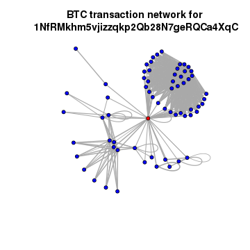

<!-- setup vignette boiler plate
NB: Do not add yaml code here, put it at the start of the top level Rmd -->

*(This blog was produced on: 2015-01-31.)*  


<!-- NB: Do not add yaml code here, put it at the start of the top level Rmd -->



# Bitcoin

## Installation
* <http://beautifuldata.net/2015/01/querying-the-bitcoin-blockchain-with-r>


```r
library(devtools)
devtools::install_github("Rdatatable/data.table") # , build_vignettes=FALSE)
# library(data.table)
install_github('jangorecki/Rbitcoin')
```

```r
install.packages("Rbitcoin", dependencies = TRUE, repos = "http://cran.us.r-project.org")
```


```r
library(Rbitcoin)
```

```
## Loading required package: data.table
## You are currently using Rbitcoin 0.9.2, be aware of the changes coming in the next releases (0.9.3 - github, 0.9.4 - cran). Do not auto update Rbitcoin to 0.9.3 (or later) without testing. For details see github.com/jangorecki/Rbitcoin. This message will be removed in 0.9.5 (or later).
```

```r
library(magrittr)
```

##  Aggregated trade prices

```r
# no need for antiddos function anymore as it is now built-in every web call
# wait <- antiddos(market = 'kraken', antispam_interval = 5, verbose = 1)
market.api.process('kraken',c('BTC','EUR'),'ticker')
```

```
##    market base quote           timestamp market_timestamp     last
## 1: kraken  BTC   EUR 2015-01-31 22:30:42             <NA> 200.2016
##        vwap  volume      ask     bid
## 1: 202.9868 2344.14 200.2016 200.006
```

```r
trades <- market.api.process(market = 'kraken', curr = c('BTC', 'EUR'), action = 'trades'
  , verbose = T # getOption("Rbitcoin.verbose", 0),
)
```

```
## 
## 2015-01-31 22:30:42: market.api.process: processing started for kraken trades
## 2015-01-31 22:30:42: market.api.process: API call request pre-processed
## 2015-01-31 22:30:43: market.api.process: market level errors checked, no errors occurred
## 2015-01-31 22:30:46: market.api.process: API call result post-processed
## 2015-01-31 22:30:46: market.api.process: processing finished for kraken trades
```

```r
str(trades)
```

```
## List of 6
##  $ market          : chr "kraken"
##  $ base            : chr "BTC"
##  $ quote           : chr "EUR"
##  $ timestamp       : POSIXct[1:1], format: "2015-01-31 22:30:43"
##  $ market_timestamp: POSIXct[1:1], format: NA
##  $ trades          :Classes 'data.table' and 'data.frame':	1000 obs. of  5 variables:
##   ..$ date  : POSIXct[1:1000], format: "2015-01-31 14:47:47" ...
##   ..$ price : num [1:1000] 206 206 206 207 206 ...
##   ..$ amount: num [1:1000] 4.68 1.85 2.27 0.5 0.3 ...
##   ..$ tid   : chr [1:1000] NA NA NA NA ...
##   ..$ type  : chr [1:1000] "ask" "ask" "ask" "ask" ...
##   ..- attr(*, ".internal.selfref")=<externalptr>
```

```r
trades  %>% extract('trades') %>% head
```

```
## $trades
##                      date    price     amount                 tid type
##    1: 2015-01-31 14:47:47 205.8423 4.68500000                  NA  ask
##    2: 2015-01-31 14:47:47 205.6715 1.84846699                  NA  ask
##    3: 2015-01-31 14:48:00 205.8423 2.27000000                  NA  ask
##    4: 2015-01-31 14:58:55 206.5200 0.50000000                  NA  ask
##    5: 2015-01-31 14:59:21 206.3700 0.30000000                  NA  ask
##   ---                                                                 
##  996: 2015-01-31 22:26:56 200.5116 0.00349107                  NA  bid
##  997: 2015-01-31 22:26:56 200.6008 4.04793942                  NA  bid
##  998: 2015-01-31 22:27:25 200.3916 0.24527000                  NA  bid
##  999: 2015-01-31 22:30:41 200.0916 0.30000000                  NA  bid
## 1000: 2015-01-31 22:30:41 200.2016 4.70000000 1422743441989018957  bid
```

```r
# Instead of Rbitcoin.plot use rbtc.plot
rbtc.plot(trades, col='blue')
```

```
## Error in eval(expr, envir, enclos): could not find function "rbtc.plot"
```

# download and transform the blockchain data
Read every single transaction in the history of Bitcoin?

* query historical transactions for one address

```r
wallet <- blockchain.api.process('15Mb2QcgF3XDMeVn6M7oCG6CQLw4mkedDi')
seed <- '1NfRMkhm5vjizzqkp2Qb28N7geRQCa4XqC'
genesis <- '1A1zP1eP5QGefi2DMPTfTL5SLmv7DivfNa'
singleaddress <- blockchain.api.query(
  method = 'Single Address', 
  bitcoin_address = seed, 
  limit = 1e2)
txs <- singleaddress$txs
#txs[1][[1]]
#txs %>% str %>% extract2(1)
length(txs)
```

```
## [1] 12
```

* map the connections between all addresses in this strand of the Blockchain

```r
bc <- data.frame()
#txs %>%
#  (extract2('hash') -> hash) %>%
#  (extract2('inputs') -> inputs)
 
for (t in txs) {
  hash <- t$hash
  for (inputs in t$inputs) {
    from <- inputs$prev_out$addr
    for (out in t$out) {
      to <- out$addr
      va <- out$value
      bc <- rbind(bc, data.frame(from=from,to=to,value=va, stringsAsFactors=F))
    }
  }
}
bc %>% str
```

```
## 'data.frame':	495 obs. of  3 variables:
##  $ from : chr  "16zSpkt8KrpeAootkSR22vPAm2dtWP6Lav" "16zSpkt8KrpeAootkSR22vPAm2dtWP6Lav" "16zSpkt8KrpeAootkSR22vPAm2dtWP6Lav" "16zSpkt8KrpeAootkSR22vPAm2dtWP6Lav" ...
##  $ to   : chr  "1JygMEn42dRJCYQ4s9sjk3Mi5AFvTvpNbA" "1Adb94GTLUMEVCc1czbG5S7dFyqpLRe8iU" "1LKMY5rNdk6jGTvyW1DJrsE9CD6oghjQ73" "1P18JptJSKo7TL4uuG8kKRZibrMKbXWQr2" ...
##  $ value: num  1.56e+08 1.44e+08 1.52e+08 1.00e+04 1.56e+08 ...
```

```r
bc %>% tail
```

```
##                                   from                                 to
## 490 1NfRMkhm5vjizzqkp2Qb28N7geRQCa4XqC 1MbzxoJAjnSc7WUPdsiE9VrQYVCyp4rgZZ
## 491 1NfRMkhm5vjizzqkp2Qb28N7geRQCa4XqC 12JzsmEuLW73H2BkYxvT1hGXmuq28oCMix
## 492 12zBnfxqXE24LcAm4kH66bYtSQLSfqtsAh 1NfRMkhm5vjizzqkp2Qb28N7geRQCa4XqC
## 493 12zBnfxqXE24LcAm4kH66bYtSQLSfqtsAh 12zBnfxqXE24LcAm4kH66bYtSQLSfqtsAh
## 494 12zBnfxqXE24LcAm4kH66bYtSQLSfqtsAh 1NfRMkhm5vjizzqkp2Qb28N7geRQCa4XqC
## 495 12zBnfxqXE24LcAm4kH66bYtSQLSfqtsAh 12zBnfxqXE24LcAm4kH66bYtSQLSfqtsAh
##         value
## 490 510800000
## 491     58969
## 492  20000000
## 493 917875645
## 494 490370000
## 495 937885645
```


```r
library(dplyr)
```

```
## 
## Attaching package: 'dplyr'
## 
## The following objects are masked from 'package:data.table':
## 
##     between, last
## 
## The following object is masked from 'package:stats':
## 
##     filter
## 
## The following objects are masked from 'package:base':
## 
##     intersect, setdiff, setequal, union
```

```r
data_frame
```

```
## function (...) 
## {
##     data_frame_(lazyeval::lazy_dots(...))
## }
## <environment: namespace:dplyr>
```

```r
bc %>% 
  group_by(from, to) %>% 
  summarise(value = sum(value)) -> 
  btc 
```

Finally, we’re using igraph to calculate and draw the resulting network of transactions between addresses:


```r
library(igraph)
btc.net <- graph.data.frame(btc, directed=T)
V(btc.net)$color <- "blue"
V(btc.net)$color[unlist(V(btc.net)$name) == seed] <- "red"
nodes <- unlist(V(btc.net)$name)
E(btc.net)$width <- log(E(btc.net)$value)/10
plot.igraph(btc.net, vertex.size=5, edge.arrow.size=0.1, vertex.label=NA, main=paste("BTC transaction network for\n", seed))
```

 


<!-- *** reproducibility *** 
NB: Do not add yaml code here, put it at the start of the top level Rmd 
-->

# Reproducibility
This final 'boiler plate' section highlights how this vignette was created.

## To recreate this vignette

Additional semantic markup can be added to the citations themselves, such as the reason for the citation. 
https://github.com/trinker/knitcitations 

* `knitrBootstrap` 
* Running behind the scenes:  
    * `knitr` (Xie, 2014) 
    * `rmarkdown` (Allaire, McPherson, Xie, Wickham, Cheng, and Allen, 2014) 
    * Cite an R package using the 'bibentry' object (Temple Lang, 2014).


```r
# TODO: parse permalink? varialble
print(rmarkdown::metadata$yamlFileName) # permalink
docName <- rmarkdown::metadata$yamlFileName

## Create the vignette
library('knitrBootstrap') 
knitrBootstrapFlag <- packageVersion('knitrBootstrap') < '1.0.0'
if(knitrBootstrapFlag) {
    ## CRAN version
    library('knitrBootstrap')
    cat("\n\n\tmetadata:title", rmarkdown::metadata$title, "\n\n")
    # TODO: stopifnot(file.exists(paste0(rmarkdown::metadata$title, ".Rmd")))
    print(system.time(knit_bootstrap(docName, chooser=c('boot', 'code'), show_code = TRUE)))
    # unlink('dots.md') # why remove .md file and in yaml?
} else {
    ## GitHub version
    library('rmarkdown')
    print(system.time(render(docName)))
}
unlink('citations.bib')
## Note: if you prefer the knitr version use:
# library('rmarkdown')
# system.time(render(docName, 'html_document'))

## Extract the R code
library('knitr')
knit(docName, tangle = TRUE)

KnitPost <- function(input, base.url = "/") {
    require(knitr)
    opts_knit$set(base.url = base.url)
    fig.path <- paste0("figs/", sub(".Rmd$", "", basename(input)), "/")
    opts_chunk$set(fig.path = fig.path)
    opts_chunk$set(fig.cap = "center")
    render_jekyll()
    knit(input, envir = parent.frame())
}
# TODO: insert the file name dynamically (both from _drafts and _posts?)
KnitPost(docName)
```

## YAML boiler plate

```r
str(rmarkdown::metadata) # https://github.com/rstudio/rmarkdown/issues/260
```

```
##  list()
```

## `R` information

### Session and packages

```
## Session info -----------------------------------------------------------------------------
```

```
##  setting  value                       
##  version  R version 3.1.2 (2014-10-31)
##  system   x86_64, linux-gnu           
##  ui       X11                         
##  language (EN)                        
##  collate  C                           
##  tz       <NA>
```

```
## Packages ---------------------------------------------------------------------------------
```

```
##  package       * version  date       source                                
##  DBI           * 0.3.1    2014-09-24 CRAN (R 3.1.1)                        
##  RCurl         * 1.95-4.5 2014-12-28 CRAN (R 3.1.2)                        
##  RJSONIO       * 1.3-0    2014-07-28 CRAN (R 3.1.2)                        
##  Rbitcoin        0.9.2    2014-09-01 CRAN (R 3.1.2)                        
##  Rcpp          * 0.11.3   2014-09-29 CRAN (R 3.1.2)                        
##  RefManageR    * 0.8.40   2014-10-29 CRAN (R 3.1.2)                        
##  XML           * 3.98-1.1 2013-06-20 CRAN (R 3.1.2)                        
##  assertthat    * 0.1      2013-12-06 CRAN (R 3.1.2)                        
##  bibtex        * 0.4.0    2014-12-31 CRAN (R 3.1.2)                        
##  bitops        * 1.0-6    2013-08-17 CRAN (R 3.1.2)                        
##  chron         * 2.3-45   2014-02-11 CRAN (R 3.1.2)                        
##  data.table      1.9.5    2015-01-31 Github (Rdatatable/data.table@84ba115)
##  devtools        1.7.0    2015-01-17 CRAN (R 3.1.2)                        
##  digest        * 0.6.8    2014-12-31 CRAN (R 3.1.2)                        
##  dplyr           0.4.1    2015-01-14 CRAN (R 3.1.2)                        
##  evaluate      * 0.5.5    2014-04-29 CRAN (R 3.1.2)                        
##  formatR       * 1.0      2014-08-25 CRAN (R 3.1.2)                        
##  htmltools     * 0.2.6    2014-09-08 CRAN (R 3.1.2)                        
##  httr          * 0.6.1    2015-01-01 CRAN (R 3.1.2)                        
##  igraph          0.7.1    2014-04-22 CRAN (R 3.1.2)                        
##  knitcitations   1.0.5    2014-11-26 CRAN (R 3.1.2)                        
##  knitr           1.8.15   2015-01-11 local                                 
##  lazyeval      * 0.1.10   2015-01-02 CRAN (R 3.1.2)                        
##  lubridate     * 1.3.3    2013-12-31 CRAN (R 3.1.2)                        
##  magrittr        1.5      2014-11-22 CRAN (R 3.1.2)                        
##  memoise       * 0.2.1    2014-04-22 CRAN (R 3.1.2)                        
##  plyr          * 1.8.1    2014-02-26 CRAN (R 3.1.2)                        
##  rmarkdown     * 0.4.2    2015-01-11 Github (rstudio/rmarkdown@514d134)    
##  rstudioapi    * 0.2      2014-12-31 CRAN (R 3.1.2)                        
##  stringr       * 0.6.2    2012-12-06 CRAN (R 3.1.2)
```

### Runtime 

Vignette generated in 9.9 seconds.   
<p>Timestamp 2015-01-31 22:30:48. <!-- Date the vignette was generated -->

<!-- *** Bibliography END ***
NB: Do not add yaml code here, put it at the start of the top level Rmd 
-->

# Bibliography

Citations made with `knitcitations` (Boettiger, 2014).


[1] J. Allaire, J. McPherson, Y. Xie, et al. _rmarkdown: Dynamic Documents for
R_. R package version 0.4.2. 2014. <URL: http://rmarkdown.rstudio.com>.

[2] C. Boettiger. _knitcitations: Citations for knitr markdown files_. R package
version 1.0.5. 2014. <URL: http://CRAN.R-project.org/package=knitcitations>.

[3] J. Hester. _knitrBootstrap: Knitr Bootstrap framework._ R package version
1.0.0. 2014. <URL: https://github.com/jimhester/>.

[4] D. Temple Lang. _RCurl: General network (HTTP/FTP/...) client interface for
R_. R package version 1.95-4.5. 2014. <URL:
http://CRAN.R-project.org/package=RCurl>.

[5] Y. Xie. "knitr: A Comprehensive Tool for Reproducible Research in R". In:
_Implementing Reproducible Computational Research_. Ed. by V. Stodden, F. Leisch
and R. D. Peng. ISBN 978-1466561595. Chapman and Hall/CRC, 2014. <URL:
http://www.crcpress.com/product/isbn/9781466561595>.


