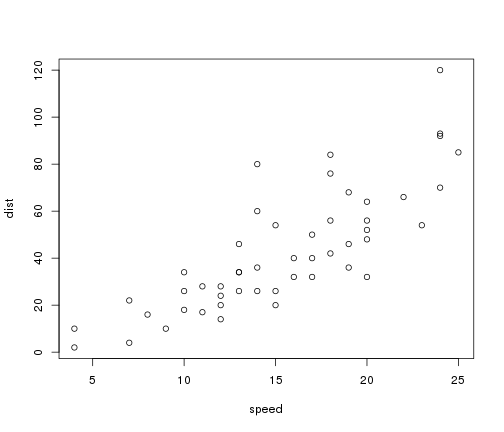

========================================================

This is an R Markdown document. Markdown is a simple formatting syntax for authoring web pages (click the **Help** toolbar button for more details on using R Markdown).

```r
library(devtools)
install_github("RODProt", "QBRC")
```

```
## Warning: Username parameter is deprecated. Please use QBRC/RODProt
```

```
## Downloading github repo QBRC/RODProt@master
## Installing RODProt
## '/usr/lib/R/bin/R' --vanilla CMD INSTALL  \
##   '/tmp/RtmpCvOW03/devtools472325d1e60a/QBRC-RODProt-1f69227'  \
##   --library='/usr/local/lib/R/site-library' --install-tests
```

```r
library(RODProt)
myUrl <- "http://raw.github.com/QBRC/RODProt/4f401d0773bcfa613c6640fad8cce356b28ecf95/inst/extdata/mixed.json"
read_json_table()
```

```
## [1] C1 C0
## <0 rows> (or 0-length row.names)
```

```r
# Or to get some more traditional CSV data as it might exist in the Simple Data Format:
library(RODProt)
pkg <- read_data_package("http://raw.github.com/datasets/house-prices-us/0b5042bbe9a2c2537a3bd708287321396b534710/datapackage.json")
file <- get_resource(pkg, "national", overlook.types=TRUE)
#  overlook.types parameter must be set to TRUE if you're attempting to load a file that has an unsupported data type (such as date)
 
 
library(RODProt)
pkg <- read_data_package("http://data.okfn.org/data/cpi/datapackage.json")
cpi <- get_resource(pkg, "cpi.csv", overlook.types=TRUE)
```

```
## Error in fromJSON(getter$get(content)): unexpected character 'C'
```

```r
head(cpi)
```

```
## Error in head(cpi): object 'cpi' not found
```


http://data.okfn.org/data
 
https://github.com/QBRC/RODProt
 
http://data.okfn.org/data 
 
https://github.com/mylesmharrison/WTI_ON_gasprices
 
http://okfnlabs.org/blog/2014/09/11/data-api-for-data-packages-with-dpm-and-ckan.html
 

You can also embed plots, for example:


```r
plot(cars)
```

 

